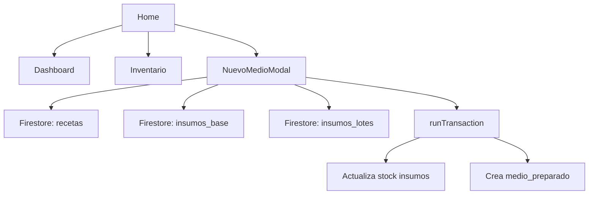

# FungiTrack – Arquitectura de la Aplicación

> **Objetivo**: Documentar la arquitectura actual del proyecto, identificar los principales módulos y sus interdependencias, para que sea posible trabajar en paralelo con otro agente.

---

## 1. Visión General
- **Tipo de aplicación**: Single‑Page Application (SPA) desarrollada con **React 18** + **Vite** (bundler).
- **Framework UI**: React + React‑Router para routing.
- **Estado global**: Uso intensivo de **React hooks** (`useState`, `useEffect`). No hay Redux ni Context API en este proyecto; el estado se mantiene localmente en cada componente.
- **Persistencia**: **Firebase Firestore** (base de datos NoSQL) y **Firebase Auth** (no mostrada en los componentes, pero configurada en `firebase.js`).
- **Servicios auxiliares**:
  - `firebase.js` – Inicializa Firebase, exporta `db`, `auth` y `storage`.
  - `src/services/driveService.js` – Interfaz con Google Drive (para archivos de evidencia).
  - `src/services/cnDatabase.js` – Helpers para consultas de códigos de normas.
  - `src/services/migrateCategories.js` – Migración de categorías de insumos.
- **Compilación / Deploy**: Vite (`npm run dev` → `http://localhost:5173`). El build se genera con `npm run build` en la carpeta `dist/`.

---

## 2. Estructura de Carpetas
```
maxi/
├─ public/                # Archivos estáticos (favicon, manifest)
├─ src/                    # Código fuente
│   ├─ assets/            # Imágenes, fuentes, íconos
│   ├─ components/        # Pantallas y componentes UI
│   │   ├─ NuevoMedioModal.jsx   # Formulario de creación de medios (más complejo)
│   │   ├─ Dashboard.jsx         # Dashboard principal
│   │   ├─ Home.jsx
│   │   ├─ ScannerPage.jsx      # Escáner QR
│   │   └─ …
│   ├─ pages/            # Rutas del router (wrapper de componentes)
│   ├─ services/          # Lógica de negocio / interacción con Firebase, Drive, etc.
│   ├─ utils/             # Funciones auxiliares (idGenerator, imageUtils)
│   ├─ firebase.js        # Configuración de Firebase
│   ├─ config.js          # Variables de entorno y constantes de la app
│   ├─ App.jsx            # Entrada principal de la UI
│   └─ main.jsx           # Montaje de ReactDOM
├─ vite.config.js        # Configuración de Vite
├─ package.json          # Dependencias, scripts (`dev`, `build`, `lint`)
└─ README.md
```

---

## 3. Principales Componentes y Responsabilidades
| Componente | Responsabilidad | Principales Hooks / Lógicas |
|------------|----------------|-----------------------------|
| **NuevoMedioModal.jsx** | Formulario para crear/editar "medios de cultivo". Maneja selección de receta, lote, envases, cálculo de cantidades, escáner QR y la transacción Firestore que persiste el lote creado. | `useState` (selectedLotes, envasesList, formData, loading), `useEffect` (carga de datos Firestore), funciones `handleSubmit`, `handleScanSuccess`, `verifyAndSelectLot`. |
| **Dashboard.jsx** | Vista principal con métricas rápidas y movimientos recientes. | `useEffect` para suscripción a `medios_preparados`, cálculo de datos agregados. |
| **ScannerPage.jsx** | Pantalla dedicada al escáner QR (utiliza `Html5Qrcode`). | `useEffect` para iniciar/parar cámara, callbacks de escaneo. |
| **InventoryPage.jsx** | Listado y gestión de insumos base y lotes. | Consultas a `insumos_base` y `insumos_lotes`, filtros, edición inline. |
| **Home.jsx** | Portada con enlaces a módulos. | Navegación mediante `react-router-dom`. |
| **Maintenance.jsx** | Herramientas de mantenimiento (reset de usuarios, migración de categorías). | Llamadas a funciones de `services/migrateCategories.js`. |

---

## 4. Flujo de Creación de un Medio (Caso de Uso)
1. **Usuario abre el modal** → `NuevoMedioModal` monta y ejecuta varios `onSnapshot` para obtener recetas, insumos, envases.
2. **Selecciona receta** → Se cargan los ingredientes y se calculan cantidades.
3. **Escanea QR** (opcional) → `handleScanSuccess` valida lote y actualiza `selectedLotes`.
4. **Envía formulario** → `handleSubmit`:
   - Calcula `totalConsumo` y `recipientesDeductions`.
   - **Transacción Firestore** (`runTransaction`):
     - Lee stock de insumos y recipientes.
     - Verifica existencia y suficiente stock.
     - Descuenta stock de insumos y recipientes.
     - Crea documentos en `medios_preparados`.
5. **Resultado** → Se muestra toast de éxito y el modal se cierra.

---

## 5. Dependencias Clave (package.json)
```json
"dependencies": {
  "react": "^18.2.0",
  "react-dom": "^18.2.0",
  "react-router-dom": "^6.14.0",
  "firebase": "^12.12.0",
  "html5-qrcode": "^2.3.8",
  "vite": "^5.2.0",
  "@mui/material": "^5.15.0",
  "@mui/icons-material": "^5.15.0"
}
```
---

## 6. Puntos Críticos / Áreas de Mejora
- **Estado Global Fragmentado**: Cada componente mantiene su propio estado. Si se añaden más pasos al proceso de creación, la coordinación será compleja. Considerar Context API o Zustand para compartir `selectedLotes`, `envasesList`, etc.
- **Transacciones Firestore**: Ya se arregló el orden de lecturas/escrituras, pero sigue habiendo **consultas que requieren índices** (ver logs). Crear los índices en la consola de Firebase para evitar errores de `failed-precondition`.
- **Validaciones de UI**: Algunos inputs cambian de *uncontrolled* a *controlled* (warnings en la consola). Unificar los valores iniciales (`value={formData.xxx || ''}`) para eliminar esos warnings.
- **Manejo de Errores**: Actualmente se usa `alert`. Sería más elegante usar un **Snackbar** (MUI) o un componente de notificación centralizado.
- **Testing**: No hay tests unitarios. Añadir pruebas con **Jest + React Testing Library** para validar `handleSubmit` y la lógica de cálculo.
- **Performance**: El modal tiene varios `useEffect` que escuchan colecciones completas. Si la base crece, podrían ralentizar la UI. Considerar paginación o consultas más específicas.

---

## 7. Roadmap de Mejoras (Prioridad)
1. **UI/UX** – Refactorizar inputs controlados, agregar feedback visual (spinners, snackbars). (Alta prioridad)
2. **Estado Global** – Implementar Context Provider para `MediaCreationContext`. (Media)
3. **Índices Firestore** – Generar los índices faltantes (recetas‑ingredientes, insumos_lotes‑lote_interno). (Alta)
4. **Testing** – Añadir pruebas unitarias y de integración.
5. **Documentación** – Generar diagramas de componentes (Mermaid) y flujo de datos.
6. **Optimización** – Lazy‑load de componentes pesados como `ScannerPage`.

---

## 8. Diagramas (Mermaid)

---

**Fin del reporte**

*Este documento se ha guardado como artefacto `FungiTrack_Architecture_Report.md` en la carpeta de artefactos.*
